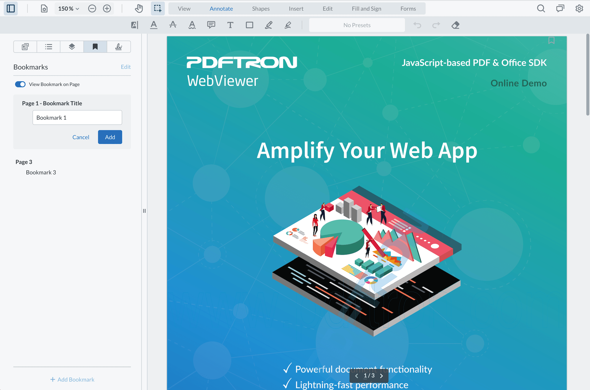

# WebViewer User Bookmarks sample - using files and Node.js backend

[WebViewer](https://www.pdftron.com/documentation/web/) is a powerful JavaScript-based PDF Library that's part of the [PDFTron PDF SDK](https://www.pdftron.com). It allows you to view and annotate PDF files on your web app with a fully customizable UI.



This is a WebViewer User Bookmarks sample to show how you can save and load user bookmarks through files with a Node.js backend.

For more information, see this [guide](https://www.pdftron.com/documentation/web/guides/bookmark/user-bookmarks/).

## Initial setup

Before you begin, make sure your development environment includes [Node.js](https://nodejs.org/en/).

## Install

```
git clone https://github.com/PDFTron/webviewer-user-bookmarks-nodejs-sample.git
cd webviewer-user-bookmarks-nodejs-sample
npm install
```

## Run

```
npm start
```

## How to use

- Create bookmarks using the `Add Bookmark` button in the bookmarks tab in the left panel
- Edit bookmark names by choosing the option in the context menu popup or by double-clicking on the name
- Delete bookmarks using the option in the context menu popup
- The new multi-select mode also allows for deleting multiple bookmarks at the same time
- Bookmarks are automatically saved using the 'userBookmarksChanged' event

## Contributing

See [contributing](./CONTRIBUTING.md).

## License

See [license](./LICENSE).
